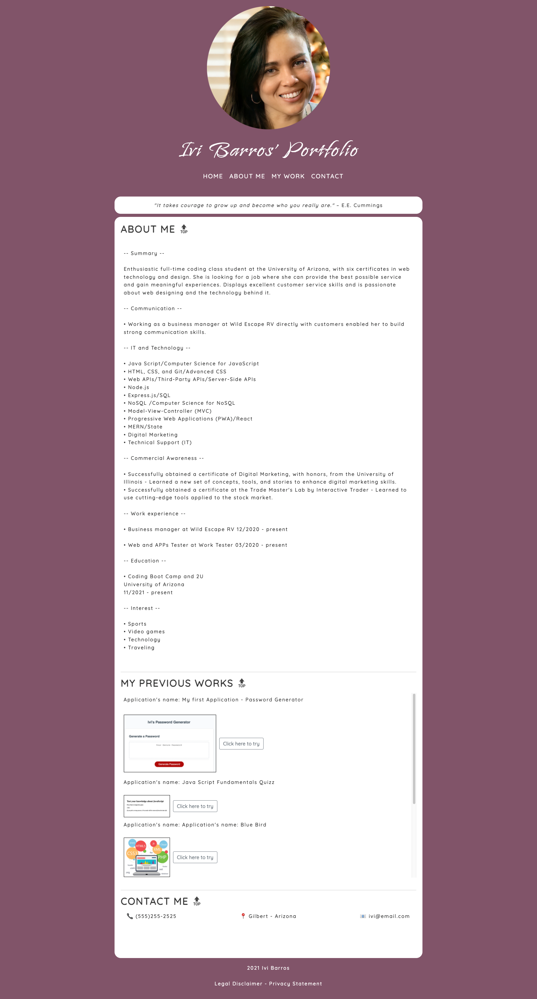

For this repository I have created from scratch my first portfolio.
Features:

- External CSS
- Bootstrap for fonts and buttons
- Linked the live sites of the apps I've created so far
- Used anchors to link the navbar and the page contents
- Used GitHub

Screenshot:
 

link to the live site:
https://ibarros19.github.io/portfolio/

Link to GitHub:
https://github.com/ibarros19/portfolio

